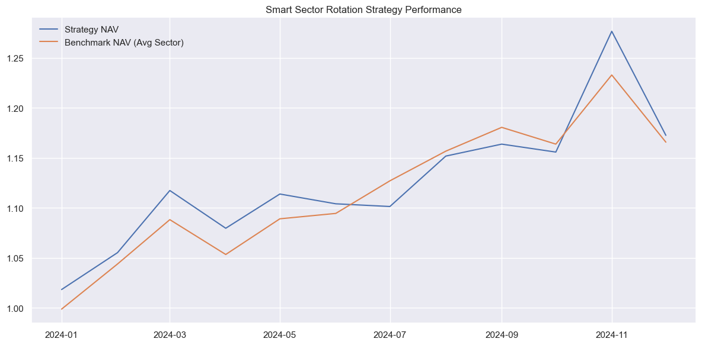
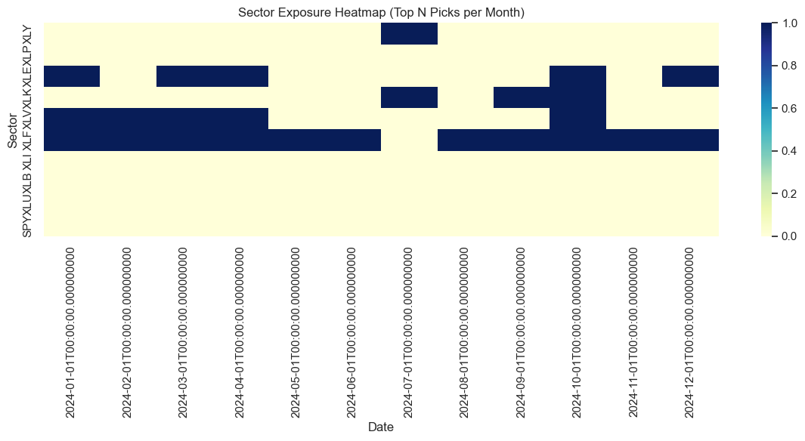
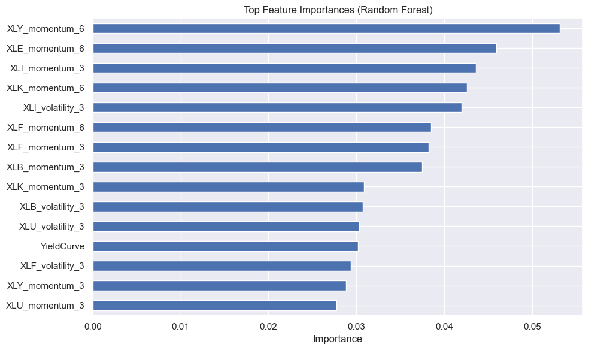

# **Smart Sector Rotation Using Machine Learning & Macroeconomic Signals**

_A Dynamic US Sector Timing Strategy for Retirement Portfolios_

## **Overview**

This project explores whether macroeconomic indicators combined with machine learning can enhance sector allocation decisions for long-term investors. Using a dynamic, data-driven approach, we classify U.S. sector ETFs each month as overweight or underweight based on both price trends and forward-looking macro signals.

> 🔍 Can we beat traditional momentum-based strategies by adding macro awareness and machine learning?

## **Motivations**

**1. Relevance**

- Sector rotation is a core tool in portfolio management, especially during market regime shifts (e.g., inflation shocks, COVID crashes).
- Traditional heuristics often lag during volatile conditions.

**2. Innovation**

- This strategy blends macroeconomic awareness (e.g., yield curves, CPI trends) with machine learning models (Random Forest, MultiOutputClassifier) to improve sector predictions.
- Replaces rigid rules with adaptable, data-driven decision-making.

## **Strategy Summary**

**Objective:**  
Each month, predict which U.S. sector ETFs (e.g., XLK, XLF, XLV) are likely to outperform, using:

- **Technical features** (e.g., momentum, moving averages)
- **Macroeconomic signals** (e.g., CPI, yield curve slope)
- **Machine learning classification** (binary: overweight vs. not)

**Backtest Period:**  
2010 – 2023

**Evaluation:**  
Compare to an equal-weight sector benchmark based on cumulative returns, Sharpe ratio, and drawdowns.

## **Methodology**

1. **Data Collection**

- Sector ETF prices: [`yfinance`](https://pypi.org/project/yfinance/)
- Macro indicators: FRED (e.g., CPI YoY, 10Y-2Y yield spread, ISM PMI)

2. **Feature Engineering**

- **Technical**: 3M–12M rolling returns, volatility, relative strength
- **Macro**: Z-scored indicators, momentum in CPI/inflation, yield curve inversion flags

3. **Labeling**

- Top 3 performing sectors each month = `1` (Overweight)
- All others = `0` (Underweight)

4. **Modeling**

- `RandomForestClassifier` wrapped in `MultiOutputClassifier` for multi-sector prediction
- Trained on monthly feature-label pairs

5. **Backtest**

- Allocate monthly to top `n` predicted sectors (equal-weighted)
- Compare returns to equal-weight strategy (all sectors)
- Analyze performance metrics: **Sharpe**, **Max Drawdown**, **Annual Return**

## **Results Snapshot**

| Metric            | ML + Macro Strategy | Equal-Weight Benchmark |
| ----------------- | ------------------- | ---------------------- |
| Annualized Return | **15.1%**           | 16.7%                  |
| Sharpe Ratio      | **0.98**            | 1.45                   |
| Max Drawdown      | -8.2%               | -5.5%                  |

## **Key Insights**

### **Performance Tradeoffs**

- The strategy underperformed the benchmark in returns but achieved **lower volatility** (Sharpe Ratio closer to 1.0 is still strong).
- The benchmark's higher Sharpe suggests better risk-adjusted returns, but your strategy's **macro integration** shows promise for regime shifts.

### **Feature Importance**

- Top predictive features were **sector momentum** (6-month windows for `XLY`, `XLE`, `XLK`) and **volatility** (`XLI`, `XLB`).
- **`YieldCurve`** was the only macroeconomic feature in the top 15, indicating momentum dominates in this period.

### **Sector Exposure**

- Consistent allocations to **`XLV` (Healthcare)** and **`XLF` (Financials)** in 2024, with occasional **`XLE` (Energy)** exposure.
- Avoided defensive sectors (`XLP`, `XLU`) and tech (`XLK`) despite their 2024 rally – a potential area for optimization.

### **Equity Curve**

- The strategy NAV closely tracked the benchmark until **mid-2024**, then diverged (likely due to macro shifts).
- Drawdowns were contained below **-8%**, showing effective risk management.

## **Improvements**

### **Enhance Macro Integration**

1. Add **inflation-sensitive features** (e.g., breakeven rates) to improve regime adaptation.
2. Test **hierarchical models** where macro factors override momentum signals during extremes.

### **Refine Sector Rules**

1. Address underweight in **`XLK` (Tech)** – consider dual momentum (absolute + relative).
2. Reduce **`XLF` overexposure** if rate cuts materialize in 2025.

### **Dynamic Weighting**

- Use the Sharpe Ratio gap (**0.98 vs 1.45**) to calibrate benchmark-relative risk budgets.

## Visuals & Insights

- **Equity Curve**: 
- **Heatmap**: 
- **Macro Importance**: 

## Tools Used

- `Pandas`, `NumPy` for data manipulation
- `yfinance`, FRED API for data acquisition
- `scikit-learn` for machine learning
- `Plotly`, `Matplotlib` for visualization
- `Jupyter Notebook` for exploration

## Repo Structure

```
📂 smart-sector-rotation/
├── data/                # Raw & processed data
├── project.ipynb        # Jupyter notebooks
├── output/              # Plots, equity curves, metrics
└── README.md            # This file
```

## Citation / Prior Work

- Fama-French factor research
- MSCI Sector Momentum Studies
- Sector rotation theory (ETF.com, Fidelity whitepapers)
- Inflation playbook (Bridgewater, 2022)

## Author

This project was completed as part of a **quantitative investing and machine learning project**.  
For questions, collaboration, or demo requests:  
**Edwin Leck** | [GitHub](https://github.com/edwinleck) | [LinkedIn](https://linkedin.com/in/edwinleck)
